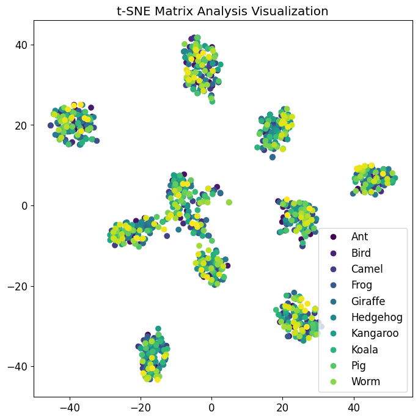

# Confusion and t-SNE Matrices Evaluation


> [4]

## :point_right: Introduction to this Blog
In this evaluation blog, we will explore two important tools used in image classification tasks: the Confusion Matrix and the t-SNE Matrix. These matrices provide valuable insights into the performance and understanding of machine learning models. We will analyze their definitions, how they were utilized in the provided code, and discuss the resulting analysis.

## :point_right: What is a Confusion Matrix?
The Confusion Matrix is a table that allows us to visualize the performance of a classification model. It provides a summary of the predicted classes versus the actual classes. The matrix is organized into four quadrants: true positive (TP), false positive (FP), true negative (TN), and false negative (FN). TP represents the correctly predicted positive samples, FP represents the incorrectly predicted positive samples, TN represents the correctly predicted negative samples, and FN represents the incorrectly predicted negative samples.

## :point_right: What did I do for the Assignment?
In my code, the Confusion Matrix was created using the ClassificationInterpretation.from_learner() function from the fastai library. By calling this function on the trained learn object, we obtain a ConfusionMatrix object named con_matrix. We can then visualize the Confusion Matrix using the plot_confusion_matrix() method, specifying the desired styling options [2].

```
# Create the confusion matrix
con_matrix = ClassificationInterpretation.from_learner(learn)

# Custom styling options
figsize=(8, 8)  # Set the size of the figure
normalize=True  # Normalize the values in the confusion matrix
title='Confusion Matrix Analysis'  # Set the title of the plot
cmap='Greens'  # Set the color map for the plot

con_matrix.plot_confusion_matrix(figsize=figsize, normalize=normalize, title=title, cmap=cmap)

```

## :brain: Evaluation and Thoughts on the Confusion Matrix


The Confusion Matrix provides valuable information about the performance of the image classification model. It helps us understand which classes are being correctly predicted and which classes are causing confusion. By analyzing the matrix, we can identify any patterns or trends in the model's misclassifications.

The matrix displayed the distribution of correctly classified and misclassified images for each animal class. By examining the matrix, we can identify if certain classes had higher or lower accuracy, and whether there were any significant confusions between specific pairs of classes. This analysis can guide us in understanding the model's strengths and weaknesses and can help improve its performance through targeted adjustments.


## :point_right: What is a t-SNE Matrix?
The t-SNE (t-Distributed Stochastic Neighbor Embedding) Matrix is a dimensionality reduction technique commonly used for visualizing high-dimensional data. It aims to project data points into a lower-dimensional space while preserving their pairwise similarities. In the context of image classification, t-SNE can be used to visualize the learned feature representations of images in a two-dimensional scatter plot.

## :point_right: WWhat did I do for the Assignment?
In my code, the t-SNE Matrix was created using the TSNE class from the sklearn.manifold module. The activations of the model's last layer were extracted using a forward hook and then concatenated and converted into a NumPy array. The t-SNE algorithm was applied to these activations to reduce their dimensionality to two. Finally, the t-SNE embeddings were plotted using a scatter plot with class labels [2].

```
hook = learn.model[-1].register_forward_hook(lambda self, input, output: activations.append(output.detach()))
activations = []
_ = learn.get_preds(dl=dls.valid)
hook.remove()

# Converting the list of activations to a single tensor
activations = torch.cat(activations, dim=0)
activations = activations.cpu().numpy()

# Performing t-SNE on the activations
tsne = TSNE(n_components=2)
embeddings = tsne.fit_transform(activations)

classes = learn.dls.vocab

# Plotting and styling the t-SNE embeddings
plt.figure(figsize=(8, 8))
scatter = plt.scatter(embeddings[:, 0], embeddings[:, 1], c=range(len(embeddings)))
plt.title('t-SNE Matrix Analysis Visualization')
plt.legend(scatter.legend_elements()[0], classes)
plt.show()

```

## :brain: Evaluation and Thoughts on the Confusion Matrix



The t-SNE Matrix visualization provides insights into the distribution and clustering of image features in a lower-dimensional space. By plotting the t-SNE embeddings, we can identify if similar classes are grouped together or if there are any overlaps or separations between classes. This visualization helps us understand how the model's learned representations are structured and whether it captures meaningful similarities between different animal classes.

By examining the t-SNE Matrix, we can interpret the spatial relationships between classes and potentially uncover patterns that align with our prior knowledge of the animal kingdom. For example, if the embeddings show clear clusters with distinct separations between different animal types, it indicates that the model has successfully learned to distinguish between these classes. On the other hand, if the embeddings are scattered without clear separations, it suggests that the model might struggle to differentiate between certain animal classes.

## 🤔 What did I learn?

In this evaluation blog, two important tools for analyzing image classification models were explored: the Confusion Matrix and the t-SNE Matrix. The Confusion Matrix provided insights into the model's performance by visualizing the predicted versus actual class distributions. It helped identify areas of improvement and potential sources of confusion. On the other hand, the t-SNE Matrix offered a visual representation of the learned feature embeddings, enabling us to analyze the clustering and relationships between different animal classes.

These evaluation techniques are valuable for understanding the strengths and weaknesses of image classification models. By leveraging the insights gained from the Confusion Matrix and the t-SNE Matrix, developers and researchers can make informed decisions to improve their models, enhance accuracy, and gain a deeper understanding of the learned representations.

> [2] Used for background information research as well as code explaination, see [References](https://github.com/sukizzz/Suki-s-Fast.ai-Blog.github.io/tree/master#point_right-references) for more details. 


