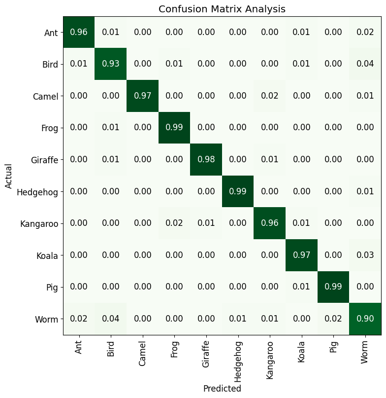

# Confusion and t-SNE Matrices Evaluation


> [4]

## :point_right: Introduction to this Blog
In this evaluation blog, we will explore two important tools used in image classification tasks: the Confusion Matrix and the t-SNE Matrix. These matrices provide valuable insights into the performance and understanding of machine learning models. We will analyze their definitions, how they were utilized in the provided code, and discuss the resulting analysis.

## :point_right: What is Confusion Matrix?
The Confusion Matrix is a table that allows us to visualize the performance of a classification model. It provides a summary of the predicted classes versus the actual classes. The matrix is organized into four quadrants: true positive (TP), false positive (FP), true negative (TN), and false negative (FN). TP represents the correctly predicted positive samples, FP represents the incorrectly predicted positive samples, TN represents the correctly predicted negative samples, and FN represents the incorrectly predicted negative samples.

## :point_right: What did I do for the Assignment?
```from fastai.vision import *

# Create the confusion matrix
con_matrix = ClassificationInterpretation.from_learner(learn)

# Custom styling options
figsize=(8, 8)  # Set the size of the figure
normalize=True  # Normalize the values in the confusion matrix
title='Confusion Matrix Analysis'  # Set the title of the plot
cmap='Greens'  # Set the color map for the plot

con_matrix.plot_confusion_matrix(figsize=figsize, normalize=normalize, title=title, cmap=cmap)
```

In my code, the Confusion Matrix was created using the ClassificationInterpretation.from_learner() function from the fastai library. By calling this function on the trained learn object, we obtain a ConfusionMatrix object named con_matrix. We can then visualize the Confusion Matrix using the plot_confusion_matrix() method, specifying the desired styling options [2].

## :brain: Evaluation and Thoughts on the Confusion Matrix



The Confusion Matrix provides valuable information about the performance of the image classification model. It helps us understand which classes are being correctly predicted and which classes are causing confusion. By analyzing the matrix, we can identify any patterns or trends in the model's misclassifications.

The matrix displayed the distribution of correctly classified and misclassified images for each animal class. By examining the matrix, we can identify if certain classes had higher or lower accuracy, and whether there were any significant confusions between specific pairs of classes. This analysis can guide us in understanding the model's strengths and weaknesses and can help improve its performance through targeted adjustments.


## :point_right: Cutting-Edge Techniques Made Simple:
Fast.ai simplifies the complexity of deep learning models by abstracting away the underlying intricacies. Through the library's high-level API, building and fine-tuning models becomes more intuitive and less daunting. Fast.ai also incorporates the latest advancements in the field, ensuring learners stay up to date with the state-of-the-art techniques.

## :point_right: Real-World Applications:
Fast.ai emphasizes the practical application of AI in various domains. From computer vision to natural language processing, the course provides comprehensive coverage of different areas, enabling learners to leverage AI in their own projects. By exploring real-world datasets and problem statements, you'll gain valuable experience in building and deploying AI models. 

## :brain: Thoughts
Overall, embarking on this journey into Fast.ai and the world of AI is an exciting endeavor. Through this blog, I aim to document my progress, share insights, and inspire others to join me in exploring the limitless possibilities of AI. Fast.ai's practical approach and powerful library will undoubtedly equip us with the skills and knowledge to make meaningful contributions in the field. So, let's dive in and unlock the vast potential of AI together! 

> [2] Used for background information research, see [References](https://github.com/sukizzz/Suki-s-Fast.ai-Blog.github.io/tree/master#point_right-references) for details. 


